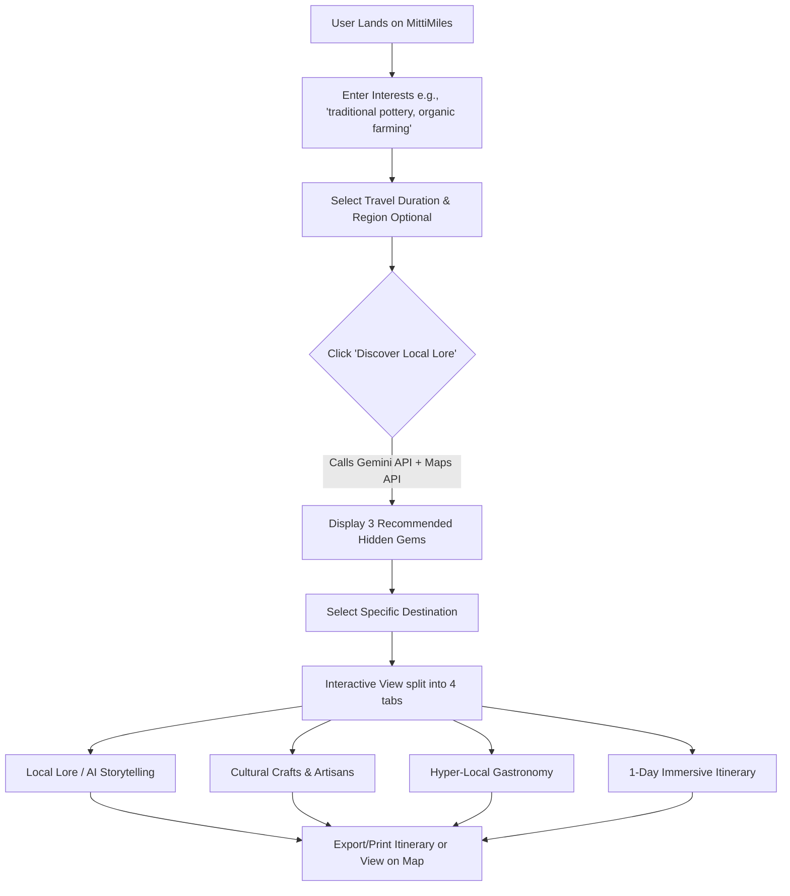
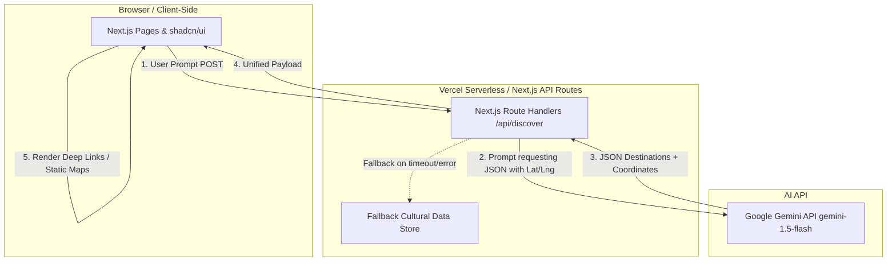

# Product Requirements Document (PRD)
## Project Name: MittiMiles (MVP)
### Role: Senior Product Manager
### Status: Draft | Implementation-Ready (1-Hour Hackathon MVP)

---

## 1. Executive Summary
**MittiMiles** is a Generative AI-powered web application designed to help travelers break away from over-commercialized tourist traps and discover authentic, lesser-known cultural destinations, historical storytelling, local crafts, and traditional culinary experiences. 

Traditional travel platforms prioritize high-volume star ratings and commercial attractions, leaving cultural heritage, local artisans, and small communities invisible. MittiMiles leverages the Google Gemini API to act as an immersive, highly knowledgeable "local guide," instantly translating user interests into a curated cultural voyage.

To align with the **1-hour hackathon constraint**, this MVP focuses exclusively on a single-page responsive Next.js application, utilizing Tailwind CSS and `shadcn/ui` for rapid frontend construction, and using Vercel for instant deployment.

---

## 2. Product Vision
To democratize travel discovery by bridging the gap between curious global travelers and local cultural keepers, ensuring that heritage, folklore, and micro-communities thrive through mindful exploration.

---

## 3. Goals & Success Metrics

### Business & User Goals
*   **Atypical Discovery:** Enable users to find cultural spots that do not show up on typical "Top 10" travel lists.
*   **Immersive Narrative:** Provide storytelling that connects travelers emotionally to the history, folklore, and local crafts of a region.
*   **Actionable Itineraries:** Deliver structured, high-context day plans focusing on experiences, events, and native cuisine.

### MVP Success Metrics (Hackathon Focus)
*   **Performance (LCP):** Under 2.0 seconds for initial page render.
*   **AI Query Latency:** Less than 3.0 seconds response time for destination generation via stream-like or highly optimized Next.js API Routes.
*   **Usability Score:** Clean mobile-responsive layout allowing exploration in 3 taps or fewer.

---

## 4. User Personas

### Persona 1: Aarav (24) — The Cultural Backpacker
*   **Profile:** Student/Freelancer traveling on a tight budget. Wants to experience raw local life.
*   **Needs:** Affordable homestays, public transit tips, folk music workshops, local street food recommendations.
*   **Pain Point:** Most online guides recommend overpriced hotels, tourist-trap restaurants, and commercialized cultural shows.

### Persona 2: Elena (35) — The Heritage & Art Enthusiast
*   **Profile:** Creative professional interested in art history, traditional architecture, and dying crafts (e.g., pottery, handloom weaving).
*   **Needs:** High-context historical narratives, connections to local master craftsmen, and museums off the beaten track.
*   **Pain Point:** Spends hours reading academic papers or books because standard travel apps only say: *"Built in 1640, nice views."*

---

## 5. Core User Stories

1.  **Discovery:** *As a traveler looking for authenticity, I want to input my niche interests (e.g., "terracotta crafts, mystical poetry") so that I can discover lesser-known towns/regions that specialize in them.*
2.  **Cultural Context:** *As a heritage lover, I want to read or listen to the folklore and historical legends of a monument or village so that I can understand its deeper cultural significance before or during my visit.*
3.  **Local Gastronomy:** *As an adventurous eater, I want to know what traditional dishes are native to the area (and the story behind them) rather than just a list of high-rated continental restaurants.*
4.  **Structured Exploration:** *As a solo traveler, I want a quick, customizable 1-day or 2-day cultural itinerary that organizes my day around local craft demonstrations, traditional meals, and evening folk performances.*

---

## 6. Core Features (Must Have vs. Nice to Have)

| Feature | Priority | Description | Hackathon Scope (MVP) |
| :--- | :--- | :--- | :--- |
| **AI Destination Discovery** | **Must Have** | Interactive search using Gemini to map user interests to authentic destinations. | Simple text input + tag selector returning 3 distinct cultural hubs. |
| **Hidden Gems Map** | **Must Have** | Visual representation of generated spots via direct links or static maps. | Coordinates outputted with clickable deep links directly to Google Maps, plus optional simple map iframe to avoid complex SDK setup. |
| **AI Storytelling** | **Must Have** | Immersive narrative covering history, myths, and local communities. | Markdown-rendered short narratives under a "Local Lore" tab. |
| **Cultural Experiences & Crafts** | **Must Have** | Highlights local crafts (e.g., block printing), traditional music, and festivals. | Curated cards detailing activities, local contacts/associations, and etiquette. |
| **AI Itinerary Generator** | **Must Have** | A detailed daily sequence of discovery events. | 1-Day structured itinerary with morning, afternoon, and evening cultural activities. |
| **Local Food & Events** | **Must Have** | Showcases hyper-local dishes and weekly village markets. | Food cards showing local delicacies (e.g., Siddu, Litti Chokha) and historic background. |
| *Audio Audio-Guides* | *Nice to Have* | Text-to-speech engine to listen to stories on-the-go. | Out of Scope. |
| *Community Connection* | *Nice to Have* | Direct messaging or forum with verified local hosts/artisans. | Out of Scope. |
| *Offline Mode* | *Nice to Have* | Storing itineraries and stories locally for low-connectivity zones. | Out of Scope. |

---

## 7. User Flow



---

## 8. Functional Requirements

### 8.1 AI Destination Discovery Engine
*   The system shall allow users to type open-ended interests in a text area (max 250 characters).
*   The system shall provide pre-defined tags (e.g., #Handicrafts, #FolkMusic, #SacredGroves, #Architecture) to append to the search query.
*   The system shall call the Gemini API (`gemini-1.5-flash`) using a structured system prompt to return JSON formatted recommendations.

### 8.2 Story & Lore Renderer
*   For any selected destination, the app must present a "Local Lore" tab.
*   The narrative must be structured with an engaging, storytelling tone (first-person or narrative guide style) covering:
    *   *The Origin Myth/Legend*
    *   *The People & Traditions*
    *   *Historical Significance*

### 8.3 Google Maps Integration & Redirection
*   The application shall display the geographical coordinates (Latitude & Longitude) for each recommended destination.
*   The application shall provide a direct, clickable deep link to Google Maps for each location (e.g., using `https://www.google.com/maps/search/?api=1&query=lat,lng`) opening in a new tab.
*   The application can embed a static map iframe or a mock interactive visual SVG marker layout to eliminate Google Maps JS SDK loading overhead.

### 8.4 Itinerary visualizer
*   The itinerary must be rendered chronologically (Morning, Afternoon, Evening).
*   Each segment must highlight a cultural action, a suggested local vendor/cooperative type (e.g., "Visit the Weavers' Cooperative"), and travel tips (e.g., "Take a local shared auto-rickshaw").

---

## 9. Non-Functional Requirements

*   **Usability:** Mobile-first design layout. Touch targets must be at least 48x48px to support travelers navigating while walking.
*   **Security:** The Gemini API key (`GEMINI_API_KEY`) MUST NOT be exposed on the frontend client. All AI generation must process through Next.js Serverless Route Handlers.
*   **Resiliency:** If the Gemini API fails or returns invalid JSON, the server must catch the error and fallback to a set of pre-configured local cultural hubs (e.g., Bishnupur for Pottery, Chettinad for Architecture) to guarantee UI continuity.

---

## 10. Technical Architecture

MittiMiles uses a modern Next.js App Router stack hosted on Vercel. 



### Tech Stack Details
*   **Framework:** Next.js 14/15 (App Router, TypeScript)
*   **Styling:** Tailwind CSS (Vanilla utilities)
*   **UI Components:** `shadcn/ui` (Radix UI primitives under the hood: Tabs, Dialog, Card, Input, Button)
*   **Icons:** `lucide-react`
*   **AI Integration:** `@google/generative-ai` SDK
*   **Maps API:** `@react-google-maps/api` or simple custom maps div utilizing Maps Static/JS SDK API
*   **Deployment:** Vercel

---

## 11. High-Level API Design

### POST `/api/discover`
Receives user interests and returns cultural destinations with coordinate resolutions and experiences.

**Request Body:**
```json
{
  "interests": "folk weaving, regional clay pottery, old fort ruins",
  "region": "India", 
  "durationDays": 1
}
```

**Response Body (200 OK):**
```json
{
  "destinations": [
    {
      "id": "dest-01",
      "name": "Bishnupur",
      "state": "West Bengal",
      "coordinates": {
        "lat": 23.0678,
        "lng": 87.3175
      },
      "tagline": "The terracotta town of temples and weavers",
      "description": "Bishnupur is famous for its unique terracotta temples built by the Malla kings, and its traditional Baluchari sarees.",
      "lore": {
        "title": "The Clay That Speaks of Kings",
        "story": "Long ago, because stone was scarce in the alluvial plains of Bengal, the local artisans baked local clay into exquisite tiles to adorn the walls of temples dedicated to Krishna..."
      },
      "crafts": [
        {
          "name": "Terracotta Pottery & Horse Dolls",
          "description": "Created by local Kumbhakar artisans, these stylized long-eared clay horses are symbols of local folklore.",
          "location": "Panchmura Village (20km from town center)"
        }
      ],
      "food": [
        {
          "name": "Posto-er Bora (Poppy Seed Fritters)",
          "description": "A traditional dish showcasing the heavy local use of poppy seeds, fried to a crisp in mustard oil."
        }
      ],
      "itinerary": [
        {
          "timeSlot": "Morning",
          "activity": "Explore the Shyam Rai and Rasmancha terracotta temples.",
          "localTip": "Hire a registered local cycle rickshaw guide right outside the railway station."
        },
        {
          "timeSlot": "Afternoon",
          "activity": "Visit the weaving clusters of Baluchari sarees and talk with master weavers.",
          "localTip": "Always buy directly from weaver cooperatives to ensure fair wages."
        }
      ]
    }
  ]
}
```

---

## 12. Suggested Folder Structure

The project structure keeps API logic isolated and frontend UI componentized:

```text
mittimiles/
├── src/
│   ├── app/
│   │   ├── layout.tsx         # Root Layout, global styles import
│   │   ├── page.tsx           # Interactive main single-page UI
│   │   └── api/
│   │       └── discover/
│   │           └── route.ts   # Next.js API Route for Gemini (generates places + coordinates)
│   ├── components/
│   │   ├── ui/                # shadcn/ui components (card, tabs, button, etc.)
│   │   ├── DiscoveryForm.tsx  # User query input area & tags
│   │   ├── DestinationMap.tsx # Redirection buttons & static embedded map frames
│   │   ├── DetailView.tsx     # Display for Lore, Crafts, Food, Itinerary tabs
│   │   └── Header.tsx         # Responsive navbar with logo and brand
│   ├── lib/
│   │   ├── gemini.ts          # Configures Google GenAI SDK client
│   │   └── fallbackData.ts    # JSON array used if API limit or network fail
│   └── styles/
│       └── globals.css        # Global CSS + Tailwind directives
├── public/                    # Static assets (logos, custom map markers)
├── package.json
├── tsconfig.json
└── tailwind.config.js
```

---

## 13. Security Considerations
1.  **API Key Leakage:** The Gemini API key (`GEMINI_API_KEY`) must reside securely on the server-side environment (`.env.local` locally, Vercel Config in production). It must never be prepended with `NEXT_PUBLIC_`. Maps are rendered using direct client-side deep links, avoiding any Maps API key leakage or complex proxy setup.
2.  **Prompt Injection & Input Length Mitigation:** Standardize inputs. The API router will truncate user input text to 250 characters and strip HTML tags before appending it to the system instructions sent to Gemini.
3.  **JSON Sanitization:** AI responses are occasionally returned with extra text markdown formatting (e.g., ```json ... ``` blocks). The API parser must clean and validate the JSON string before returning it to the frontend to prevent client runtime crashes.

---

## 14. Development Plan (1-Hour Timeline)

This highly condensed roadmap details how to build and verify the MVP within 60 minutes:

```mermaid
gantt
    title MittiMiles 1-Hour Hackathon Dev Plan
    dateFormat  mm
    axisFormat %M min

    section Setup
    Environment & Project Init         :active, des1, 0, 8m
    section Backend
    Gemini API Route & Fallback        :des2, after des1, 14m
    section Frontend
    Core Layout & Search UI            :des3, after des1, 15m
    Tabs Details & Map Redirection     :des4, after des3, 11m
    section Integration
    E2E Verification & Vercel Deploy   :des5, after des4, 12m
```



### Phase 1: Initialize (Minutes 0 - 8)
*   Scaffold Next.js App using TypeScript, Tailwind, and App Router.
*   Initialize `shadcn/ui` components: `tabs`, `card`, `button`, `input`, `badge`, `skeleton` using `npx shadcn-ui@latest init` and `add`.
*   Configure root stylesheet and dynamic Google Fonts.

### Phase 2: AI Prompt & Backend Routes (Minutes 8 - 22)
*   Create `src/lib/gemini.ts` configuring the `@google/generative-ai` SDK.
*   Implement `src/app/api/discover/route.ts` with structured prompt instructions that force Gemini to output both cultural data and coordinate pairs (latitude/longitude) in pure JSON.
*   Define the static local `fallbackData.ts` matching the schema to serve as instant fallback on timeout or error.

### Phase 3: Build the UI Components & Map Redirections (Minutes 22 - 48)
*   **DiscoveryForm:** Responsive input bar and quick-select tag buttons (e.g. *Folk Crafts*, *Textiles*).
*   **DetailView:** Clean `shadcn/ui` tabs containing Oral History, Crafts, Gastronomy, and Day Planner cards.
*   **DestinationMap:** Render coordinate badges alongside a prominent action button ("Open in Google Maps") that deep-links directly using standard web-mapping queries, eliminating maps libraries and key latency.

### Phase 4: Verification & Deployment (Minutes 48 - 60)
*   Verify frontend-backend integration with custom interest queries.
*   Confirm local offline fallback triggers smoothly on simulated API error states.
*   Execute production build tests and deploy to Vercel via CLI or dynamic Git connection.

---

## 15. Future Enhancements (Post-MVP)
*   **Offline Audio Narrative Sync:** Cache audio-synthesized local lore stories using standard web workers so users can listen without cell coverage in remote places.
*   **Artisan E-Commerce & Bookings:** Allow direct tipping or direct bookings for native homestays and weaving workshops, ensuring 100% of proceeds go to the host communities.
*   **Dynamic Event Calendars:** Connect with local tourism board APIs and community calendars to show real-time village festival schedules and weekly market days.


# 🎨 UI Color Theme – Destination Discovery & Cultural Experiences

## Theme: **Sunset Explorer** 🌅

A warm, vibrant, and modern color palette designed for **Gen-Z travelers**. It blends the excitement of exploration with the authenticity of cultural experiences, creating a fresh and engaging visual identity.

---

## Color Palette

| Purpose        | Color          | Hex       |
| -------------- | -------------- | --------- |
| Primary        | Sunset Orange  | `#FF6B35` |
| Secondary      | Coral          | `#FF8A5B` |
| Accent         | Turquoise      | `#2EC4B6` |
| Background     | Warm Off-White | `#FFF8F2` |
| Surface        | White          | `#FFFFFF` |
| Primary Text   | Charcoal       | `#1F2937` |
| Secondary Text | Slate Gray     | `#6B7280` |
| Success        | Emerald        | `#22C55E` |
| Warning        | Amber          | `#F59E0B` |
| Border         | Light Gray     | `#E5E7EB` |

---

## Brand Gradient

Use this gradient for hero sections, CTA buttons, and highlights.

```css
background: linear-gradient(
  135deg,
  #FF6B35 0%,
  #FF8A5B 50%,
  #2EC4B6 100%
);
```

---

## Typography

### Headings

* **Poppins**
* **Sora**

### Body

* **Inter**

### Display (Optional)

* **Space Grotesk**

---

## UI Style

* Rounded corners (`rounded-2xl` / `rounded-3xl`)
* Soft shadows
* Glassmorphism for hero cards
* Gradient CTA buttons
* Large destination imagery
* Minimal, clean layouts
* Smooth micro-interactions
* Card hover animations
* Mobile-first responsive design

---

## Component Colors

### Buttons

**Primary**

* Background: `#FF6B35`
* Text: `#FFFFFF`

**Hover**

* Background: `#E85A2C`

---

### Secondary Button

* Background: `#FFFFFF`
* Border: `#FF6B35`
* Text: `#FF6B35`

---

### Cards

* Background: `#FFFFFF`
* Border: `#E5E7EB`
* Border Radius: `20px`
* Shadow:

```css
box-shadow: 0 10px 30px rgba(0,0,0,0.08);
```

---

### Inputs

* Background: `#FFFFFF`
* Border: `#D1D5DB`
* Focus Border: `#2EC4B6`

---

## Icon Colors

| Category             | Color     |
| -------------------- | --------- |
| Attractions          | `#FF6B35` |
| Hidden Gems          | `#2EC4B6` |
| Storytelling         | `#8B5CF6` |
| Food                 | `#F59E0B` |
| Cultural Experiences | `#EC4899` |
| Events               | `#22C55E` |

---

## Tailwind Theme

```js
colors: {
  primary: "#FF6B35",
  secondary: "#FF8A5B",
  accent: "#2EC4B6",
  background: "#FFF8F2",
  surface: "#FFFFFF",
  text: "#1F2937",
  muted: "#6B7280",
  success: "#22C55E",
  warning: "#F59E0B",
  border: "#E5E7EB",
}
```

---

## Design Principles

* Bright, welcoming, and travel-inspired
* Strong visual hierarchy
* High readability and accessibility
* Clean, modern cards with generous spacing
* Vibrant accents to highlight AI-powered insights
* Consistent use of gradients for branding
* Optimized for both desktop and mobile experiences

---

## Why This Theme?

This palette captures the warmth of sunsets, the vibrancy of local cultures, and the freshness of discovery. The orange tones evoke adventure and energy, while the turquoise accent represents exploration and authenticity. Combined with clean neutrals, the interface feels modern, approachable, and highly engaging for a Gen-Z audience.
